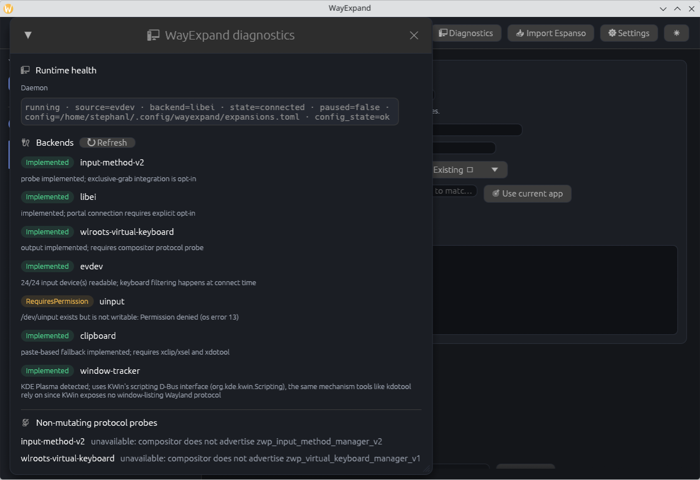

# WayExpand

[](https://github.com/itchyitchy123/wayexpand/actions/workflows/ci.yml)
[](https://github.com/itchyitchy123/wayexpand/releases)
[](LICENSE)
[](https://www.rust-lang.org/)

## Native text expansion for Linux Wayland

Type a short trigger and get the text you use every day—locally, instantly,
and without sending anything to the cloud.

```text
;;email  →  Hi,
            Stephan Loesevitz
            Cyberdeck Labs
            stephan@example.com
```

WayExpand is built for Wayland rather than adapted to it. It is written in
Rust, has a GUI and CLI, and collects no telemetry.


> **Status:** the matching engine, configuration format, CLI, and GUI are
> usable today. Desktop capture and injection are compositor-dependent, so
> run `wayexpand doctor` on your session before enabling a backend. See the
> [support matrix](docs/SUPPORT_MATRIX.md) for the exact distinction between
> implemented, available, and certified.

## Install in a minute

On Ubuntu or Debian:

```sh
sudo add-apt-repository ppa:cyberducttape/ppa
sudo apt update
sudo apt install wayexpand
wayexpand doctor
```

`doctor` checks your live Wayland session and explains which capture and
injection paths are available. Then open the snippet manager:

```sh
wayexpand-gui
```

From source, use the same diagnostic-first workflow:

```sh
git clone https://github.com/itchyitchy123/wayexpand
cd wayexpand
./scripts/install-user.sh
wayexpand doctor
```

## Migrating from Espanso?

Import an existing Espanso YAML file without modifying the source:

```sh
wayexpand import espanso ~/.config/espanso/match/base.yml > imported.toml
```

Or use the GUI’s Espanso importer for a preview before saving. See
[Migrating from Espanso](docs/MIGRATION_FROM_ESPANSO.md) for the full guide.

## Your first snippet

Add this to `~/.config/wayexpand/expansions.toml`, then type `;;email` in any
supported application:

```toml
[[expansion]]
trigger = ";;email"
replacement = """Hi,
Stephan Loesevitz
Cyberdeck Labs
stephan@example.com"""
```

The GUI can create and preview snippets like this without editing TOML by
hand.

The compact user workflow is:

```sh
wayexpand setup
wayexpand status
wayexpand edit
```

`setup` is interactive: it detects the installed IBus engine and verified
paths, then selects a compatibility mode rather than requiring protocol
knowledge. Recommended chooses the safest available option; Maximum
compatibility and Experimental are explicit opt-ins. It never grants raw-input
permissions or silently accepts portal consent; use `--yes` for reviewed
automation. Experts can use `wayexpand explain-backend` for protocol detail.

Backend-specific services and binaries remain available for advanced users.
The stdin daemon harness is intentionally not installed as a normal user
service.

## Why WayExpand?

- **Wayland-native design:** input-method-v2, libei/EIS, and wlroots
  virtual-keyboard paths are separate, explicit backends—not an X11-shaped
  implementation with Wayland support bolted on.
- **Works offline:** no account, cloud service, or telemetry.
- **Fast to live with:** define a trigger once and expand signatures,
  support replies, commands, dates, and boilerplate everywhere you type.
- **A GUI when you want one, a CLI when you need one:** search, preview,
  diagnostics, scripting, and JSON output all use the same configuration.
- **Honest diagnostics:** `wayexpand doctor` distinguishes verified backends
  from backends that are merely available to try and may require authorization.

## Supported desktop paths

WayExpand currently has paths for KDE Plasma/KWin, Sway, Hyprland, river, and
GNOME, but availability depends on the compositor version, protocols exposed,
permissions, and the selected backend. No compositor is currently certified
by automated end-to-end tests. Check your own session:

```sh
wayexpand doctor
wayexpand certify --json
wayexpand explain-backend
```

See [COMPOSITOR_MATRIX.md](docs/COMPOSITOR_MATRIX.md) for the current path and
certification status, and [GETTING_STARTED.md](docs/GETTING_STARTED.md) for
desktop-specific setup.

## Architecture

```
                    ┌─────────────────────────────┐
                    │   wayexpand-core (engine)   │
                    │  trie matcher · templates   │
                    │  config validation · undo   │
                    └───────────┬─────────────────┘
                                │  TextInjector / InputSource traits
                ┌───────────────┼──────────────────────────┐
                │               │                          │
      ┌─────────▼──────┐ ┌──────▼──────────┐   ┌──────────▼─────────┐
      │ input-method-v2│ │ evdev capture   │   │   libei / EIS      │
      │  (capture+type)│ │(compositor-     │   │ (portal-mediated)  │
      │ (exclusive,    │ │ agnostic, needs │   │     output)        │
      │  XKB-based)    │ │ `input` group)  │   └────────────────────┘
      └────────────────┘ └─────────────────┘
                                │
                    ┌───────────▼──────────────┐
                    │ wlroots virtual-keyboard│
                    │    (output only)         │
                    └──────────────────────────┘
```

Every backend implements a small trait (`InputSource` for capture,
`TextInjector` for output) and is selected conservatively or explicitly at
daemon startup (`--source=`, `--backend=`). Use
`wayexpand explain-backend` to inspect automatic selection. A backend that
doesn't exist for your compositor is a documented gap, not a runtime
surprise: `app_filter`-scoped snippets **fail closed** (never match) rather
than matching everywhere when window tracking isn't available, the same
philosophy the matcher applies to `word-boundary` mode when its rolling
buffer has already evicted the context it needs.

## Other installation methods

**Arch Linux (packaging preview):**

```sh
# The repository PKGBUILD is not yet an official AUR submission.
git clone https://github.com/itchyitchy123/wayexpand
cd wayexpand
makepkg -si
```

The PKGBUILD currently targets `x86_64` only. AUR publication and aarch64
support require clean-chroot build and upgrade/removal verification first.

> **Fedora/RHEL note:** No official Copr repository exists yet. Build from source using the RPM spec file
> in the repository, or use the release tarball with `install-release.sh`. Community contributions welcome.

**From source** (any distro, no packaging required):

```sh
git clone https://github.com/itchyitchy123/wayexpand
cd wayexpand
./scripts/install-user.sh          # builds release binaries, installs to ~/.local/bin
wayexpand doctor
```

Both installers are non-destructive by default (no service is enabled or
started until you pass `--enable`) and refuse to run as root — see
[Installation](#installation) below for the full picture, including
`--source=evdev` for compositors with no `input-method-v2` or
virtual-keyboard support (KWin/KDE Plasma, as of KWin 6.6).

## Screenshots

The dashboard above shows the snippet library: search, category filters,
per-row status toggles, and a live preview pane that never auto-executes a
command-backed snippet (see [docs/COMPATIBILITY.md](docs/COMPATIBILITY.md)).

**Diagnostics** reports every backend's actual state
(`Implemented`/`RequiresPermission`/`Unavailable`) plus non-mutating
protocol probes, in one view — the same information `wayexpand doctor
--json` exposes to scripts and health checks:



Eight color packs ship in the GUI, including retro terminal themes (VT220
green, IBM 3270 blue, Commodore 64) alongside the default — see
[docs/COLOR_PACKS.md](docs/COLOR_PACKS.md) and
[docs/CUSTOMIZATION.md](docs/CUSTOMIZATION.md). Full accessibility support
(font scaling 0.8×–2.0×, WCAG 2.1 AA contrast, keyboard focus indicators) is
documented alongside them.

## Features

**Core engine**
- UTF-8/Unicode-aware suffix matching for committed text via a trie;
  longest-match trigger families
  (`:a` and `:address` coexist correctly)
- Optional `word-boundary` matching for triggers that must not fire inside
  larger words — fails closed if its context window has been evicted rather
  than guessing
- `propagate_case`: typing a trigger as `UPPERCASE` or `Capitalized`
  applies the same casing to the replacement (validated against generated
  case variants, not just the literal trigger, so it can't silently collide
  with another snippet)
- Template variables (`{{date}}`, `{{date+3d}}`, `{{username}}`,
  `{{cursor}}` placement, and more) rendered without shelling out
- Bounded, cached, direct-program expansions for dynamic content (no shell
  interpretation — a program and argument list, executed directly)
- `app_filter`: restrict a snippet to specific applications, backed by a
  focused-window tracker (KDE Plasma via KWin's scripting bridge today)
- Undo-last-expansion via a configurable key chord on exclusive input sources;
  disabled with evdev because its physical hotkey also reaches the application

**Safety and reliability**
- Parse-then-swap config reloads: a malformed config is rejected before it
  replaces the live one, both from the CLI and from the daemon watching the
  file
- Matching suspends automatically in password fields on backends that
  report sensitive focus
- The control socket is permission-checked and confined to a private,
  owner-verified directory
- Every backend, queue, and child process is bounded — see
  [SECURITY.md](SECURITY.md) for the full threat model

**Interfaces**
- Native Wayland-capable GUI (`wayexpand-gui`): search, live preview,
  metadata editing, Espanso import with a diff-style preview, diagnostics,
  atomic saves, bounded undo history, daemon pause/resume
- Dependency-light terminal UI (`wayexpand-ui`) for SSH sessions and
  systems without a GPU presentation path
- Scriptable CLI with stable `--json` output for `list`, `preview`,
  `status`, and `doctor` — see [COMPATIBILITY.md](docs/COMPATIBILITY.md)
  for exactly which fields are guaranteed
- One-shot, atomic `set-enabled`/`set-mode` commands so a script or
  integration never needs to hand-edit TOML

**Migration**
- Espanso import (`wayexpand import espanso`) converts YAML matches to
  TOML, skips unsupported non-string matches with a warning, and never
  touches the source file

See [docs/FOR_SYSADMINS.md](docs/FOR_SYSADMINS.md) for
production-ready snippets (SSL certs, logrotate, systemd units, firewall
rules, Docker, deployment scripts) and enterprise deployment guidance if you
want a running start rather than an empty library.

For large snippet libraries, see [PERFORMANCE_TUNING.md](docs/PERFORMANCE_TUNING.md).
For backend failures, follow the [Troubleshooting Checklist](docs/TROUBLESHOOTING_CHECKLIST.md).

## Installation

WayExpand's deployment depends on your compositor and its Wayland protocol support. The valid backend combinations are:

**Explicit option: input-method-v2 (single unified backend, experimental)**

This backend has exclusive keyboard capture and may discard unrelated
navigation, function, Escape, or other unsupported keys. Setup displays its
warning and requires explicit confirmation before enabling it. Inspect it
directly with:
```sh
wayexpand setup --experimental-input-method-v2
```
Do not enable it on a production, shared, password-manager, or regulated
machine unless you have tested the exact compositor and application set.

Pros:
- Simpler setup (one backend handles capture+output)
- Respects sensitive-field signals in password fields
- Requires no special permissions

Cons:
- Experimental — unsupported key events (Escape, arrows, F-keys) may not pass through (see [support matrix](docs/SUPPORT_MATRIX.md))

**Option 2: evdev + libei/wlroots (split capture/output)**

This is the normal explicit route when you have acknowledged raw keyboard
capture. Automatic mode does not enable evdev merely because the process can
read `/dev/input`. Output goes through libei on desktops with a RemoteDesktop
portal (KDE Plasma, GNOME) or wlroots on wlroots compositors; the shipped unit
uses libei:
```sh
sudo ./scripts/install-evdev-permissions.sh --dry-run   # preview first
sudo ./scripts/install-evdev-permissions.sh             # then apply
systemctl --user enable --now wayexpand-evdev.service
```

Pros:
- Better keyboard fidelity (all keys pass through)
- evdev provides compositor-independent capture; output still requires a compatible libei/EIS portal or virtual-keyboard protocol

Cons:
- **Requires `input` group membership** — grants raw keyboard access to **all keystrokes** system-wide, not just WayExpand's
- **No password-field protection** — matching is never suspended in password fields
- **Legacy/simple permission model** — active-seat ACLs or a device broker are future security work; see [EVDEV_ACCESS_DESIGN.md](docs/EVDEV_ACCESS_DESIGN.md)
- **Best-effort timing** — non-exclusive capture cannot make rapid trigger replacement atomic; see [P0_3_DECISION_REQUIRED.md](docs/P0_3_DECISION_REQUIRED.md)
- Experimental — read [SECURITY.md](SECURITY.md) before enabling

This unit restarts on failure with a 2-second delay and a systemd rate limit of
five starts per 60 seconds. A portal session may still need fresh user consent
after revocation or an expired restoration token; after the rate limit is hit,
restart it yourself after fixing the cause:
`systemctl --user restart wayexpand-evdev.service`.

**Which should I choose?**

Run `wayexpand doctor` after installation to see which backends your compositor supports:
```sh
wayexpand doctor
```

If you're on KDE Plasma, use **Option 2** (evdev) after reviewing the raw
keyboard visibility tradeoff. It has better keyboard fidelity, but it is not
enabled automatically.

If `wayexpand explain-backend` reports readable evdev as disabled,
choose `--source=evdev --backend=libei` only after acknowledging that WayExpand
will see global keyboard input. Input-method-v2 is intentionally not offered by
normal setup: choose it only in a disposable/test session where password-field
signals matter more than general key pass-through and unrelated keys may be
lost.

**Granting evdev permission**

Granting the permission is a separate, explicit, root-requiring step the installers never run for you. Understand what `input` group membership means before proceeding (see [SECURITY.md](SECURITY.md) for details).

```sh
sudo ./scripts/install-evdev-permissions.sh --dry-run   # preview first
sudo ./scripts/install-evdev-permissions.sh             # then apply
```

Once `wayexpand doctor` reports capture readiness:

```sh
systemctl --user enable --now wayexpand-evdev.service
```

This unit restarts on failure with a 2-second delay and a systemd rate limit of
five starts per 60 seconds. A portal session may still need fresh user consent
after revocation or an expired restoration token; after the rate limit is hit,
restart it yourself after fixing the cause:
`systemctl --user restart wayexpand-evdev.service`.

Neither installer runs as root, enables a service automatically, or
overwrites an existing configuration. `install-user.sh` builds from source;
`install-release.sh` installs the prebuilt binaries from a downloaded
[release](https://github.com/itchyitchy123/wayexpand/releases) tarball. To
remove an installation, run `./scripts/uninstall-user.sh` (`--purge` also
deletes the configuration directory).

## Using the CLI

```sh
wayexpand test ';;hello' expansions.toml           # simulate matching, print the result
wayexpand test ';;hello' --json expansions.toml
wayexpand preview ':today' expansions.toml         # render templates without matching
wayexpand list expansions.toml
wayexpand validate expansions.toml
wayexpand validate --fleet --json                    # CI-friendly merged validation
wayexpand set-enabled ':sig' off expansions.toml   # atomic, single-snippet edit
wayexpand set-mode ':sig' word-boundary expansions.toml
wayexpand import espanso ~/.config/espanso/match/base.yml > imported.toml
wayexpand doctor                                   # human-readable backend/session report
wayexpand doctor --json                            # stable schema for health checks
wayexpand certify --json                           # explicit certification evidence record
wayexpand explain-backend                          # explain automatic backend selection
wayexpand fleet status                              # inspect merged fleet layers
wayexpand fleet status --json                        # inspect provenance as JSON
```

When the daemon starts without an explicit config path, it loads the normal
`~/.config/wayexpand/expansions.toml` first and then merges standard fleet
layers from `/etc/wayexpand/snippets.d/`,
`~/.config/wayexpand/snippets.d/`, and
`~/.local/share/wayexpand/packs/`. Explicit `WAYEXPAND_CONFIG` paths and
positional config paths retain single-file behavior. Duplicate triggers or
hotkeys fail closed and are reported as configuration errors.

`test`/`preview` never inject text into another application. For a plain
(template) expansion, `test` is a pure, side-effect-free dry run. For a
**command-backed** expansion, `test` still runs the configured program for
real to produce its output — there's no way to preview a command's output
without running it. Review `program`/`args` before running `test` against
a config you didn't write yourself.

Configuration resource limits are documented in
[`docs/CONFIGURATION_LIMITS.md`](docs/CONFIGURATION_LIMITS.md).

## Documentation

**Start here:** [DOCUMENTATION_INDEX.md](docs/DOCUMENTATION_INDEX.md) — find what you need by use case or role

**Get started:**
- [docs/GETTING_STARTED.md](docs/GETTING_STARTED.md) — installation, first snippet, verify it works
- [docs/TROUBLESHOOTING.md](docs/TROUBLESHOOTING.md) — common issues, solutions, and diagnostics
- [docs/SUPPORT_MATRIX.md](docs/SUPPORT_MATRIX.md) — what's tested vs. experimental per compositor
- [docs/MIGRATION_FROM_ESPANSO.md](docs/MIGRATION_FROM_ESPANSO.md) — if switching from Espanso

**Configuration & customization:**
- [docs/CUSTOMIZATION.md](docs/CUSTOMIZATION.md) — GUI themes, color packs, language support
- [docs/CONFIGURATION_LIMITS.md](docs/CONFIGURATION_LIMITS.md) — resource and safety boundaries

**Enterprise & security:**
- [docs/ORGANIZATION_POLICY.md](docs/ORGANIZATION_POLICY.md) — policy enforcement and fleet management
- [docs/FLEET_CONFIG.md](docs/FLEET_CONFIG.md) — multi-machine deployment (Ansible, Puppet examples)
- [docs/SECRET_MANAGEMENT.md](docs/SECRET_MANAGEMENT.md) — handling sensitive data safely

**Compatibility & design:**
- [docs/COMPATIBILITY.md](docs/COMPATIBILITY.md) — which CLI/JSON/config fields are stable
- [docs/BACKENDS.md](docs/BACKENDS.md) — backend protocols and architecture
- [docs/SUPPORT_MATRIX.md](docs/SUPPORT_MATRIX.md) — tested combinations per desktop/protocol

**Examples & reference:**
- [docs/FOR_SYSADMINS.md](docs/FOR_SYSADMINS.md) — ready-made snippets and enterprise deployment
- [docs/ANSIBLE_INTEGRATION.md](docs/ANSIBLE_INTEGRATION.md) — fleet deployment playbooks

**For developers:**
- [docs/DEVELOPMENT.md](docs/DEVELOPMENT.md) — building, testing, and contributing

Non-English documentation: [Deutsch](README.de.md).

## Contributing

See [CONTRIBUTING.md](CONTRIBUTING.md) for the development setup, PR
checklist, and project structure. CI runs formatting, the full test suite,
Clippy with warnings denied, shellcheck, installer idempotence in an
isolated home, systemd unit validation, and a separate dependency-advisory
job on every change.

## License

[MIT](LICENSE)
