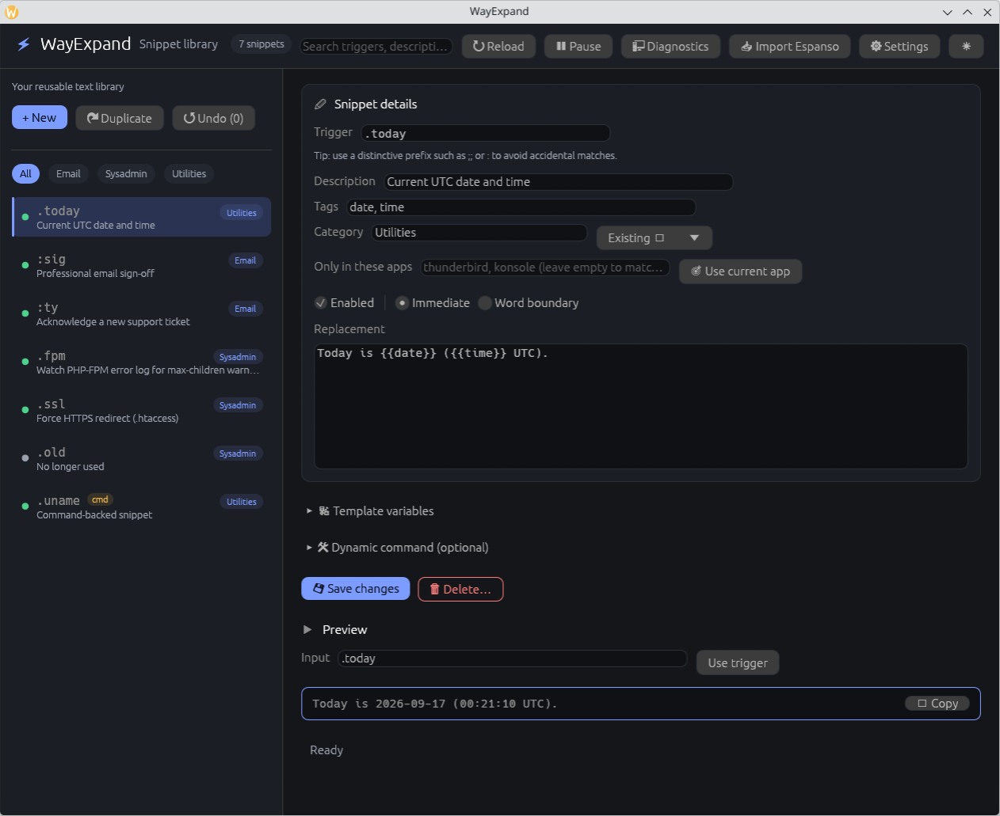

# WayExpand

[](https://github.com/cyberducttape/wayexpand/actions/workflows/ci.yml)
[](https://github.com/cyberducttape/wayexpand/releases)
[](LICENSE)
[](https://www.rust-lang.org/)

## Fast, local text expansion for modern Linux desktops

Type a short trigger and get the text you use every day — locally, instantly,
and without sending anything to the cloud.

```text
;;sig   →  Stephan Loesevitz
           Cyberdeck Labs

;;date  →  2026-09-23

;;ip    →  Server: prod-api-03
           Status: investigating
```

WayExpand is a text expander for Linux desktops: signatures, support replies,
dates, command output, boilerplate, and team snippets wherever your desktop
backend supports safe expansion.

No cloud. No account. No telemetry.

Built to be boring to operate: local by default, explicit about permissions,
and conservative when configuration or command execution looks unsafe.

It includes a GUI, a scriptable CLI, Espanso import, templates,
command-backed snippets, and fleet policy support. The backend engineering is
there when you need to inspect it, but the goal is simple: type less, paste
less, and keep your snippets local.



> **Status:** WayExpand is usable today, but desktop integration is still
> compositor-dependent. Run `wayexpand doctor` on your own session before
> enabling a backend. No compositor is currently certified by automated
> end-to-end tests; see the [support matrix](docs/SUPPORT_MATRIX.md).

## Will it work on my desktop?

WayExpand has paths for KDE Plasma/KWin, GNOME, Sway, Hyprland, and other
wlroots compositors, but Wayland input support varies by desktop, version, and
portal/protocol availability.

After installing, run:

```sh
wayexpand doctor
wayexpand explain-backend
```

For the current desktop matrix, see:

- [Getting started](docs/GETTING_STARTED.md)
- [Support matrix](docs/SUPPORT_MATRIX.md)
- [Compositor matrix](docs/COMPOSITOR_MATRIX.md)

## Install

On Ubuntu:

```sh
sudo add-apt-repository ppa:cyberducttape/ppa
sudo apt update
sudo apt install wayexpand
wayexpand doctor
wayexpand-gui
```

On Debian, use the source/release installation path for now; the Launchpad PPA
targets Ubuntu series, not Debian releases.

From source:

```sh
git clone https://github.com/cyberducttape/wayexpand
cd wayexpand
./scripts/install-user.sh
wayexpand doctor
wayexpand-gui
```

The normal installers do not run as root, enable services automatically, grant
raw-input permissions, or accept portal consent for you.

Other paths:

- Arch packaging preview: `makepkg -si`
- Release tarballs: `./scripts/install-release.sh`
- Packaging notes: [docs/PACKAGING.md](docs/PACKAGING.md)

## Create your first snippet

Create the file privately before adding this to it:

```sh
install -m 600 /dev/null ~/.config/wayexpand/expansions.toml
```

Then add this to `~/.config/wayexpand/expansions.toml`:

```toml
[[expansion]]
trigger = ";;email"
replacement = """Hi,
Stephan Loesevitz
Cyberdeck Labs
stephan@example.com"""
```

Then type `;;email` in a supported application.

Prefer the GUI?

```sh
wayexpand-gui
```

Prefer the terminal?

```sh
wayexpand setup
wayexpand status
wayexpand edit
```

## Common commands

```sh
wayexpand doctor                         # check desktop/backend availability
wayexpand setup                          # guided setup
wayexpand-gui                            # graphical snippet manager
wayexpand test ';;email' expansions.toml # simulate a trigger
wayexpand preview ':today' expansions.toml
wayexpand validate expansions.toml
wayexpand import espanso ~/.config/espanso/match/base.yml > imported.toml
```

For stable JSON output and automation contracts, see
[docs/COMPATIBILITY.md](docs/COMPATIBILITY.md).

## Features

- Fast local expansion for signatures, replies, dates, commands, and boilerplate
- GUI and CLI over the same TOML configuration
- Espanso YAML import
- Unicode-aware trigger matching
- Optional word-boundary matching
- Case propagation
- Template variables such as dates, username, and cursor placement when the
  selected backend supports cursor positioning
- Command-backed snippets without shell interpretation
- App-filtered snippets where window tracking is available
- Fleet configuration and organization policy
- Hardened daemon units and bounded resource limits

## Security and operational safety

WayExpand is designed to run as the unprivileged desktop user, work offline,
avoid telemetry, keep configuration files owner-checked, execute command
snippets without a shell, and suspend matching in sensitive fields when the
selected input backend can report them. The evdev fallback is different: it
requires explicit raw input-event access and cannot detect password fields.

The daemon also uses bounded command queues, output limits, timeouts, process
group cleanup, and organization policy that can either audit or enforce
restrictions. These controls are intended to make everyday operation
predictable, not to claim that WayExpand is a security sandbox.

Start here:

- [Threat model](THREAT_MODEL.md)
- [Security policy](SECURITY.md)
- [Sensitive-field behavior by backend](docs/BACKENDS_SENSITIVE_FIELDS.md)
- [Evdev access design](docs/EVDEV_ACCESS_DESIGN.md)

## Migrating from Espanso

```sh
wayexpand import espanso ~/.config/espanso/match/base.yml > imported.toml
```

Or use the GUI importer for a preview before saving. See
[Migrating from Espanso](docs/MIGRATION_FROM_ESPANSO.md).

## Where to go next

- New users: [docs/GETTING_STARTED.md](docs/GETTING_STARTED.md)
- Troubleshooting: [docs/TROUBLESHOOTING.md](docs/TROUBLESHOOTING.md)
- Backend details: [docs/BACKENDS.md](docs/BACKENDS.md)
- Desktop support: [docs/SUPPORT_MATRIX.md](docs/SUPPORT_MATRIX.md)
- Fleet deployment: [docs/FLEET_CONFIG.md](docs/FLEET_CONFIG.md)
- Organization policy: [docs/ORGANIZATION_POLICY.md](docs/ORGANIZATION_POLICY.md)
- Sysadmin snippets: [docs/FOR_SYSADMINS.md](docs/FOR_SYSADMINS.md)
- Full documentation index: [docs/DOCUMENTATION_INDEX.md](docs/DOCUMENTATION_INDEX.md)

Non-English documentation: [Deutsch](README.de.md).

## Contributing

See [CONTRIBUTING.md](CONTRIBUTING.md) for the development setup, PR checklist,
and project structure. CI runs formatting, tests, Clippy, shellcheck, installer
checks, systemd validation, packaging checks, and dependency advisories.

## License

[MIT](LICENSE)
