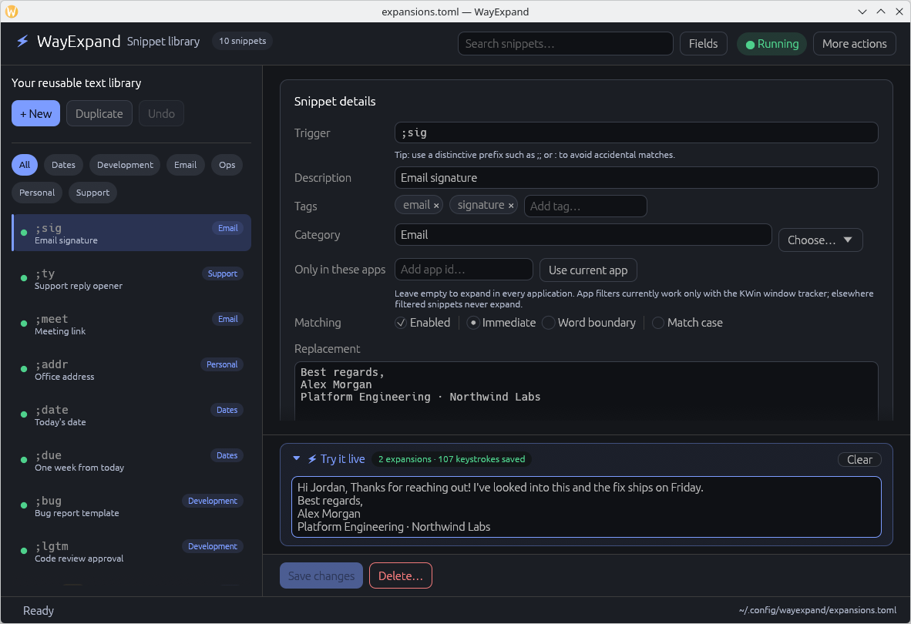
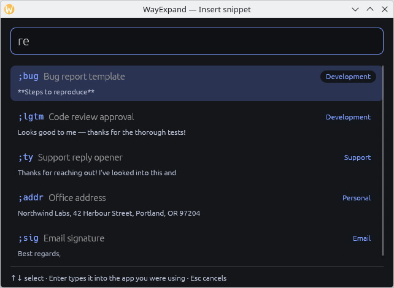
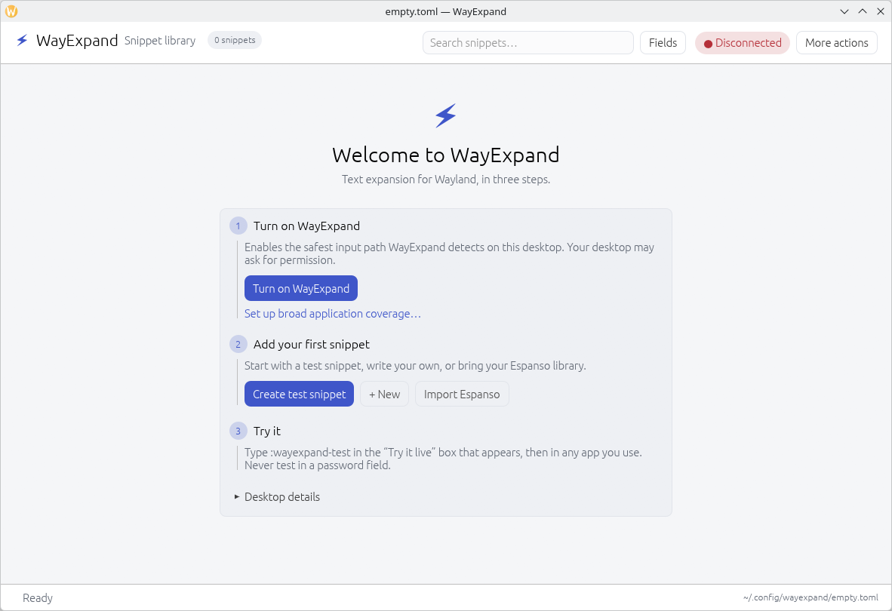

# WayExpand

[](https://github.com/cyberducttape/wayexpand/actions/workflows/ci.yml)
[](https://github.com/cyberducttape/wayexpand/releases)
[](LICENSE)
[](https://www.rust-lang.org/)

## Type less. Keep your words local.

**WayExpand is a text expander built for Wayland.** Type `;sig` and get your
signature. Type `;ty` and get your support reply — with the cursor waiting
where you need to keep typing. Dates, addresses, templates, team snippets:
local, offline, no account, no telemetry.



### What makes it different

- **See it work before you set anything up.** The *Matcher preview* panel
  expands your saved snippets as you type with the daemon's own matching
  engine — no daemon, permission, or desktop integration needed — and counts
  the keystrokes you saved. It does not exercise desktop capture or insertion;
  `wayexpand doctor` covers that.
- **Quick-insert picker.** Bind `wayexpand-gui --picker` to a keyboard
  shortcut. Type a few letters, press Enter, and the running WayExpand service
  types the snippet into the app you were using. Typing needs focused-window
  tracking (currently KDE Plasma); elsewhere, or without the service, Enter
  copies it to the clipboard. No trigger to remember.

  

- **One click to turn on.** The first-run screen detects your desktop and
  enables the safest input path it finds. It never grants raw keyboard access
  on its own.
- **Safe by design.** Matching pauses in password fields when the desktop
  reports them, app-specific snippets fail closed, command snippets run
  without a shell under timeouts and output limits, and errors never echo your
  snippet text.
- **Brings your library along.** Import Espanso YAML, edit in the GUI, the
  terminal UI, or plain TOML, and roll out team snippets with fleet policy.

### Project status at a glance

| Area | Current status |
| --- | --- |
| Configuration, CLI, and JSON contracts | Stable and regression-tested |
| Linux architectures | x86_64 and aarch64 build paths |
| Desktop integration | Wayland backends available; compositor support varies |
| Production certification | Run `wayexpand doctor`; see the [support matrix](docs/SUPPORT_MATRIX.md) |
| Distribution packages | Build and release workflows exist; check the release page for published artifacts |

## Install

For local evaluation or development, install from source. Published binaries
and packages are only supported when they are present on the [GitHub Releases
page](https://github.com/cyberducttape/wayexpand/releases); do not infer
availability from the release workflow alone. Review the [support
matrix](docs/SUPPORT_MATRIX.md) before deploying desktop integration.

For a source installation (Rust 1.95+ required):

```sh
git clone https://github.com/cyberducttape/wayexpand
cd wayexpand
./scripts/install-user.sh
wayexpand-gui
```

Then create a first snippet from the terminal:

```sh
wayexpand setup
wayexpand-ui
```

Verify the selected desktop route before typing into another application:

```sh
wayexpand doctor
wayexpand status --json
wayexpand test ';;hello'
```

The release workflow is configured to attach `.deb`, `.rpm`, and architecture
archives after its certification gates pass. Check the actual release page
before following package-install commands; a configured workflow is not
evidence that an artifact has been published. See [Packaging](docs/PACKAGING.md)
for source-build and Launchpad status.

The installers never run as root, enable services, grant raw-input access, or
accept portal consent for you.

## Your first minute



1. **Turn on WayExpand** — one click in the GUI, or `wayexpand setup` in a
   terminal.
2. **Add a snippet** — *Create test snippet*, write your own, or import Espanso.
3. **Try it** — type the trigger in *Matcher preview*, then in a normal text
   field in an app you use. Check *Desktop details* for the capabilities and
   certification status of the active integration.

Set up the picker by adding a desktop shortcut (for example <kbd>Super</kbd> +
<kbd>.</kbd>) that runs `wayexpand-gui --picker`. Scripts can do the same with
`wayexpand insert ';sig'`.

Useful commands:

```sh
wayexpand doctor          # what this desktop supports, and what is missing
wayexpand status          # is the daemon running, and on which path
wayexpand test ';sig'     # check matching without the desktop
```

## Desktop compatibility

Be precise about what works where:

- **Committed text only.** WayExpand does not see IME preedit/composition;
  finish CJK, dead-key, and Compose sequences before expecting a trigger to
  match.
- **App-specific snippets** need focused-window tracking, currently available
  only on KDE Plasma (KWin). Elsewhere they fail closed and never expand.
- **No compositor is certified yet** by automated end-to-end tests. Run
  `wayexpand doctor` on your own session before relying on a backend.
- **evdev** is an explicit compatibility fallback, never the normal or
  recommended setup. It observes every keyboard event, including password
  fields; the fact that WayExpand does not transmit password text does not
  change that observation risk. Setup never grants keyboard-device access.
  Recommended mode configures the highest-ranked route that is available and
  allowed by policy: certified routes first, then input-method-v2 (when libei
  key pass-through is available), then IBus; it never automatically selects
  evdev or another globally observing path. Use evdev only after reviewing the
  security tradeoff and explicitly choosing maximum compatibility.

See the [support matrix](docs/SUPPORT_MATRIX.md) and
[certification matrix](docs/CERTIFICATION_MATRIX.md) for evidence and known
limits.

## Security and operational safety

WayExpand is designed to run as the unprivileged desktop user, work offline,
avoid telemetry, keep configuration files owner-checked, execute command
snippets without a shell, and suspend matching in sensitive fields when the
selected input backend can report them. The evdev fallback is different: it
requires explicit raw input-event access and an additional
`--allow-evdev-sensitive-fields` acknowledgement because it cannot detect
password fields.

The daemon also uses bounded command queues, output limits, timeouts, process
group cleanup, and organization policy that can either audit or enforce
restrictions. These controls are intended to make everyday operation
predictable, not to claim that WayExpand is a security sandbox.

## Migrating from Espanso

```sh
wayexpand import espanso ~/.config/espanso/match/base.yml > imported.toml
```

The GUI defaults to a merge that preserves current snippets and reports
duplicates/conflicts; replacement is a separate explicit action. Review the
CLI's migration report or GUI preview for unmapped features before applying.
See
[Migrating from Espanso](docs/MIGRATION_FROM_ESPANSO.md).

## More information

- [Getting started and troubleshooting](docs/GETTING_STARTED.md)
- [Security and threat model](SECURITY.md) · [Threat model](THREAT_MODEL.md)
- [Backend details](docs/BACKENDS.md) · [Support matrix](docs/SUPPORT_MATRIX.md)
- [Packaging status](docs/PACKAGING.md)
- [Migration from Espanso](docs/MIGRATION_FROM_ESPANSO.md)
- [Fleet deployment](docs/FLEET_CONFIG.md) · [Documentation index](docs/DOCUMENTATION_INDEX.md)

Non-English documentation: [Deutsch](README.de.md).

## Contributing

See [CONTRIBUTING.md](CONTRIBUTING.md) for the development setup, PR checklist,
and project structure. CI runs formatting, tests, Clippy, shellcheck, installer
checks, systemd validation, packaging checks, and dependency advisories.

## License

[MIT](LICENSE)
