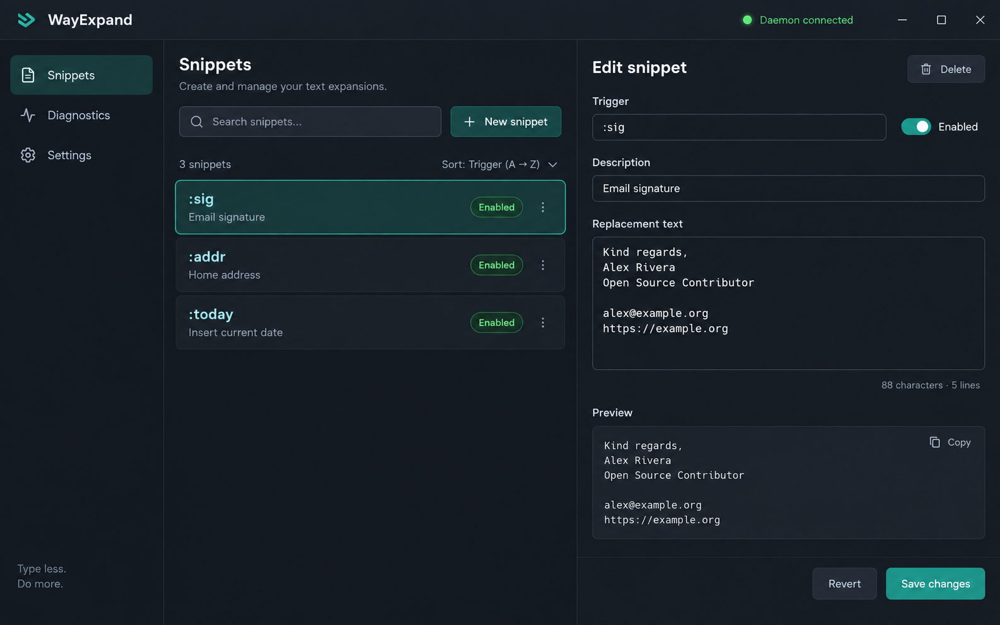
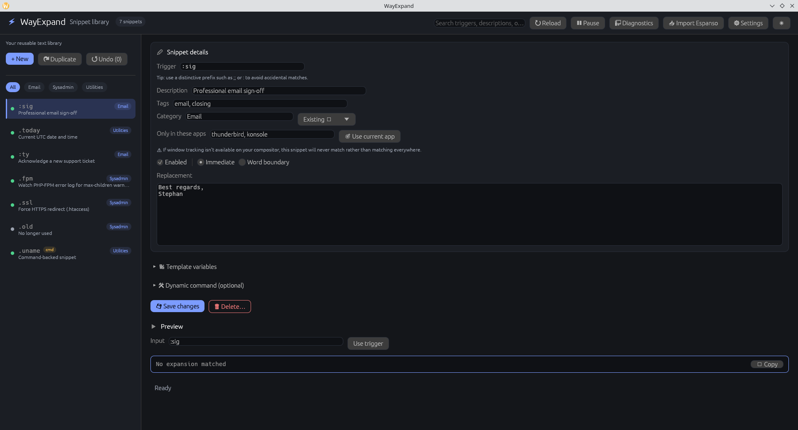
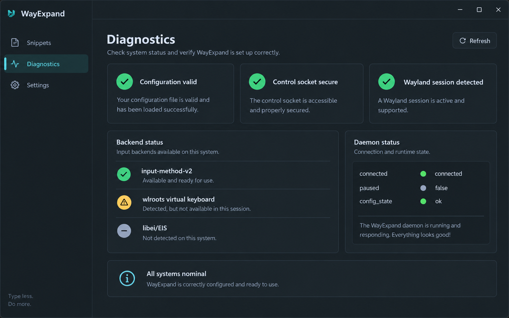

# GUI guide

The graphical editor is a native Wayland-capable application. It edits the
same TOML file used by the daemon and saves changes atomically. The terminal UI
(`wayexpand-ui`) provides the same workflow for minimal environments.

The graphical editor is organized around the daily operator workflow:

1. Search or select a snippet in the library.
2. Edit the trigger and replacement in the central editor.
3. Use the live preview to verify the result.
4. Save explicitly; the configuration is validated and written atomically.

The library shows enabled state and total counts. An empty library provides a
first-action prompt, while an empty search provides a clear-search action.
Deleting a snippet always requires confirmation and saved changes remain
recoverable through Undo.

Command-backed expansions are intentionally labeled as advanced behavior. The
editor explains that a local executable is invoked directly when the trigger
matches; shell syntax is not interpreted. Keep these entries limited to
trusted, reviewed programs.

The toolbar exposes Reload, Pause/Resume, Diagnostics, Import, and Settings.
Use Diagnostics before troubleshooting an expansion: it reports daemon state,
backend capability, and non-mutating protocol probes.

## Snippet dashboard



The dashboard is organized around fast retrieval:

- Search matches triggers, descriptions, and tags.
- The list shows enabled state and a short description.
- New snippet creates a valid, unique trigger automatically.
- Selecting a row opens the editor without losing an unsaved draft; the app
  asks whether to save or discard before switching.
- Duplicate keeps the content but generates a unique `-copy` trigger.
- Delete is persisted atomically and can be undone.

## Editing and live preview



The editor exposes every expansion field without requiring TOML knowledge:

1. Set the trigger that users type.
2. Add a useful description and comma-separated tags.
3. Write replacement text or enable a bounded direct command.
4. Choose `Immediate` or `Word boundary` matching.
5. Review the live preview, including safe template rendering.
6. Save changes.

Every save validates the complete candidate configuration first. If validation
fails, the active file is untouched and the error is shown in the status area.
After a successful save, the GUI requests a daemon reload. The daemon keeps
the previous configuration if that reload is invalid or unstable.

## Diagnostics



Diagnostics refreshes configuration validation, control-socket security,
Wayland detection, backend discovery, protocol probes, and daemon status in one
view. Treat a warning as actionable context rather than proof that every
backend is usable: permissions and compositor protocol support are separate
questions.

## Importing Espanso

Open the import flow, choose an Espanso YAML file, and preview the conversion
before applying it. Unsupported non-string matches are counted and reported;
the source file is never modified. The equivalent CLI workflow is:

```sh
wayexpand import espanso ~/.config/espanso/match/base.yml > imported.toml
wayexpand validate imported.toml
```

## Settings and undo

The settings panel currently controls the bounded rolling matcher buffer. The
accepted range is 1–4096 characters. Undo history is deliberately bounded to
32 saved states so an editing session cannot grow without limit.

## Terminal UI

```sh
wayexpand-ui
```

Useful keys are shown in the app. The terminal UI supports CRUD, external
editor replacement editing, mode changes, tags, import, reload, and bounded
undo. It is the preferred interface over SSH or on systems without a working
GPU presentation path.
